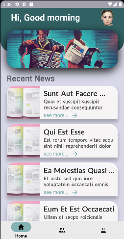
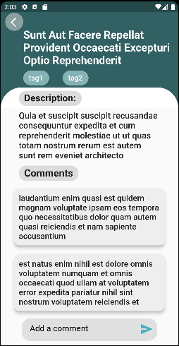
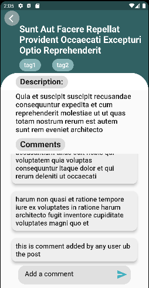
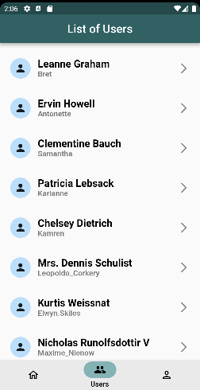
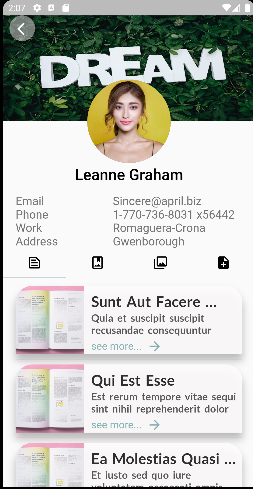
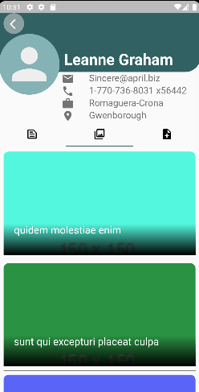
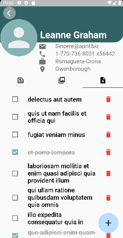

# News app

I have made a news app which contain news (post of jsonplaceholder api), comment, user's profile.

User can read news, view and add comment in the new post. We can also see all the user of the news app and can also view their profile.

Profile of user comatain user's info, post, albums of photo and todo list also.

## Task done

1. A screen to list all the posts.
2. A post detail screen which have list of comments and post new comment in the post.
3. Show list of users
4. Show the users posts, albums of photos and TODO list whic can be create, update, delete.
5. The posts, albums and todos should be either in Tabs.
6. Implement add, delete, update of todos for user.

### Implemented

1. Object Oriented approach has been implemented.
2. Naming conventions for Widgets, files, function are according to flutter recommanded.
3. Separation use of widgets.
4. Used Provider as a state management.
5. Used animations.
6. added readme file which contains screenshots and a short description of your application.
7. Used of 3rd party libraries meaningfully.

## Snapshot

        
