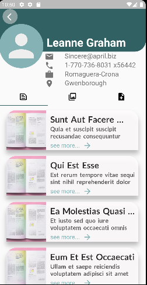
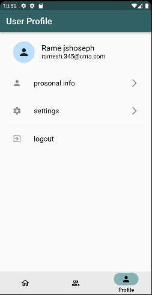

# News like app

I have made a news app which contain news (post of jsonplaceholder api), theirs comment, user's profile.

User can read news, view comments and add comment in the new post too. We can also see all the user of the news app and can also view their profile.

Profile of user comatain user's info, post, albums, photo and todo list also.

Here, i have assume that user 1 form json api have been login and viewing his/her profile. so, User 1 can add delete, update of todo list of his only.

## Task done

1. A screen to list all the posts.
2. A post detail screen which have list of comments.
3. Show list of users
4. Show the users posts, albums and photos.
5. The posts, albums and todos should be either in Tabs or BottomNavigation.
6. Implement add, delete, update of todos for user.

### Implemented

1. Object Oriented approach has been implemented.
2. Naming conventions for Widgets, files, function are according to flutter recommanded.
3. Separation use of widgets.
4. Used Provider as a state management.
5. Used animations.
6. added readme file which contains screenshots and a short description of your application.
7. Used of 3rd party libraries meaningfully.

## Snapshot

        
